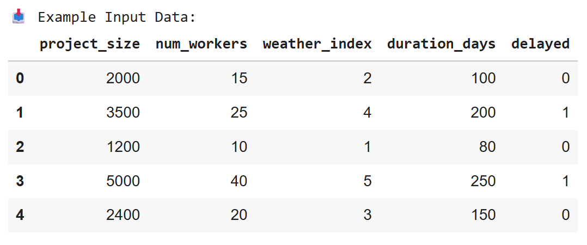
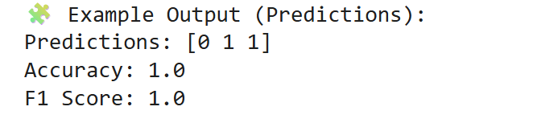

# Construction Delay Prediction

## Overview

This project, **Construction Delay Prediction**, explores how machine learning can be used to predict delays in construction projects based on various influencing factors such as weather, labor availability, material supply, and project complexity. Delays in the construction industry lead to cost overruns, inefficiencies, and disputes between stakeholders. By analyzing historical project data and delay indicators, this project aims to develop a predictive model that can identify potential delays before they occur, enabling better planning and risk mitigation.  

This repository was created as part of the **DCP 4300 – AI in the Built Environment** course at the University of Florida. The goal is to demonstrate the integration of data science and construction management concepts through practical implementation.  

### Authors

**Emma Kushner**  
- [GitHub](https://github.com/emmakushner)  

### Example Input and Output 

| Input                      | Output                    |
|----------------------------|---------------------------|
|  |  |
